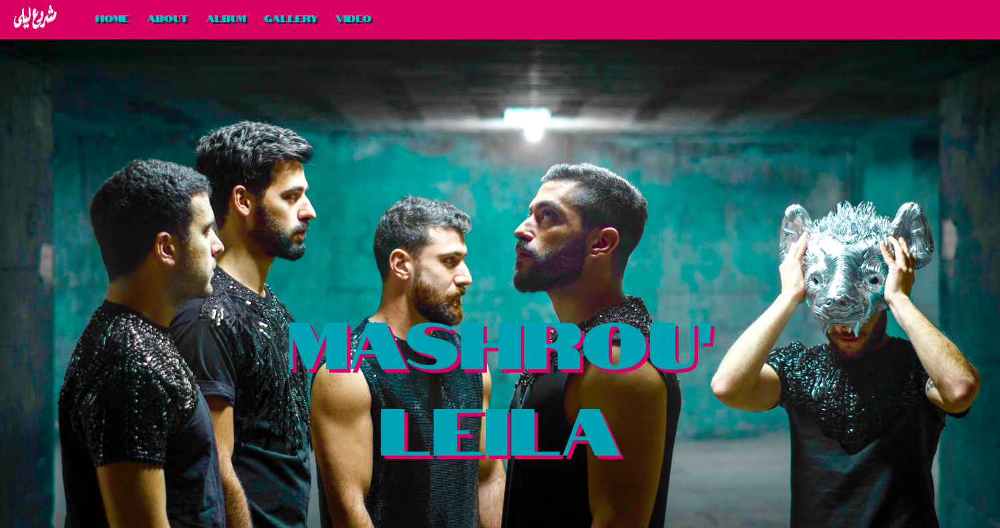

# Mashrou' Leila

This is a Pokédex that I had to make with a co-learner during my education at BeCode.

[Website Mashrou' Leila](https://hichambezzizi.github.io/WebsiteWIP/)

## Mission

- Solidify my knowledge of HTML and CSS
- Practice my HTML structure
- Practice using CSS
- Practice Responsive web design (still working on that.)

## What did I learn from this

1. Learned Progressive Enhancement: first structure (HTML) and then styling/animations (CSS).
1. Selecting the right HTML elements in my CSS to manipulate

## What was the most challenging

Since I was building this website from scratch, it was most challenging how I was going to structure my website, the design, what to add in terms of images, videos etc.

## Goal

I will keep working on this website to improve my knowledge of responsive web design and also to build it further.

